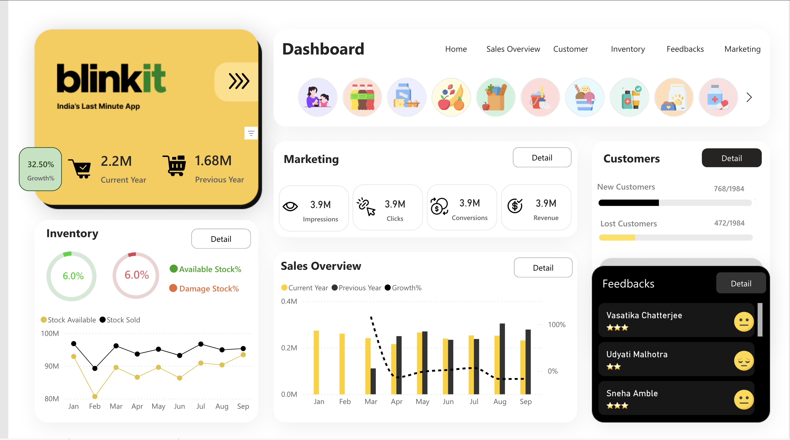
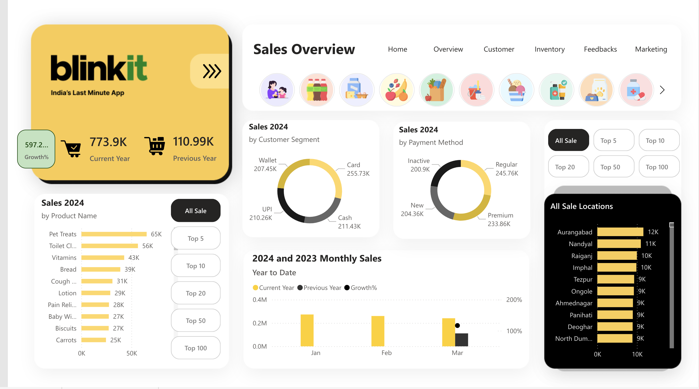
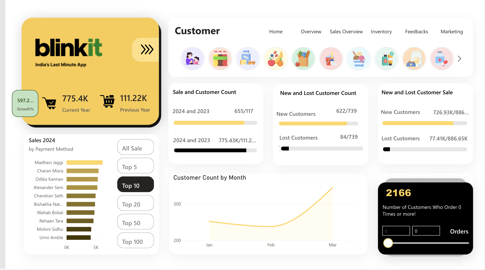
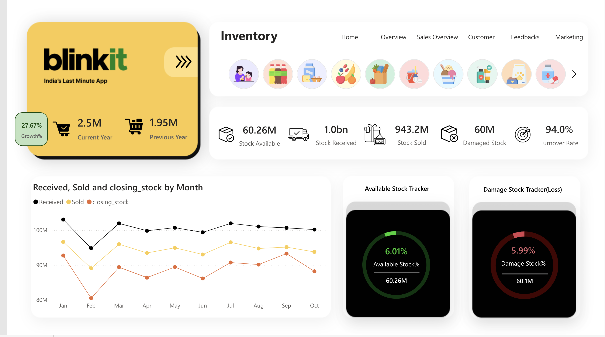
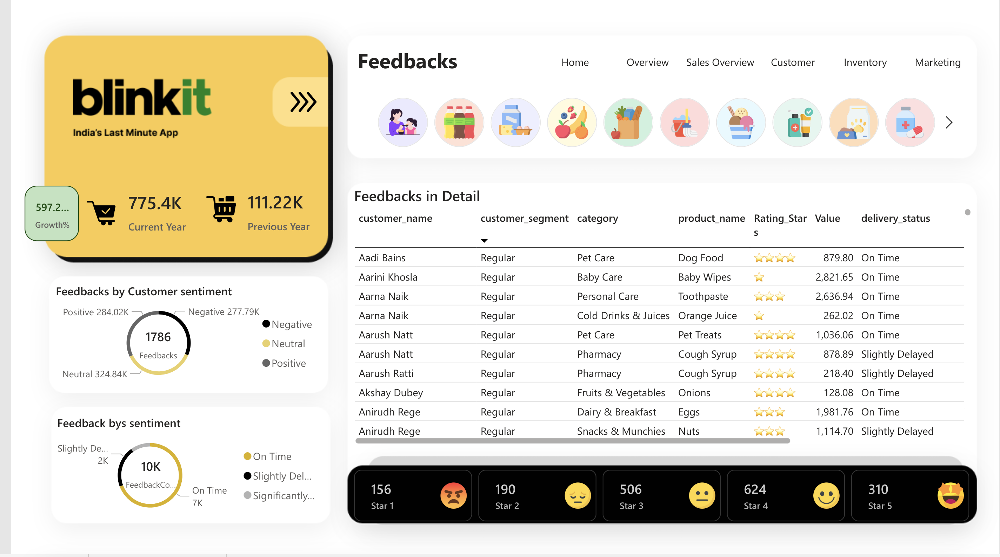
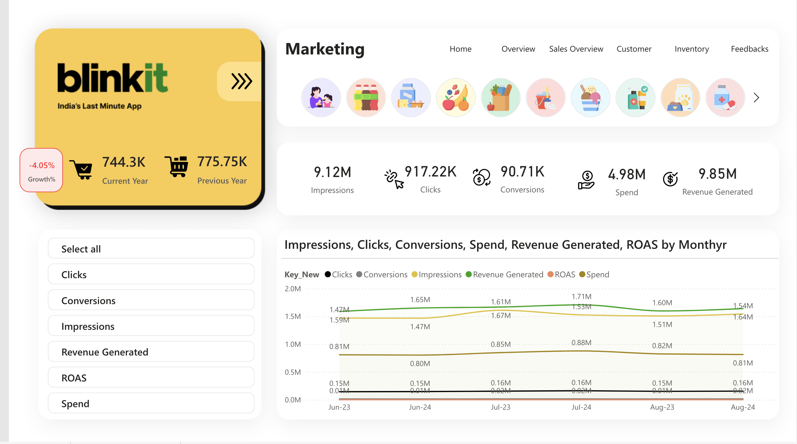

# Blinkit-Sales-Customer-Analytics-Dashboard
# Create a README.md file with the generated content
readme_content = """# Blinkit Sales Customer Analytics Dashboard
**Power BI Dashboard for Sales Analytics & Customer Insights**  

## Overview
- Designed a **Power BI dashboard** using **DBT** to analyze:
  - Sales trends  
  - Customer segmentation  
  - Financial KPIs  
- Enables **data-driven decision-making** and **business insights**.

## Key Features
 **Sales Overview** – Track annual growth, product-wise sales, and sales locations  
 **Customer Analysis** – New vs lost customers, segmentation, and purchasing behavior  
 **Inventory Tracking** – Stock availability, damage stock, and monthly trends  
 **Marketing Performance** – Clicks, conversions, impressions, and ROAS  
 **Feedback Analytics** – Customer sentiment analysis and ratings  

## Dashboard Snapshots
### 📌 **Local Repository References**
If images are stored in the `Dashboard` folder, use:

  
  
  
  
  
  


## Technology Stack
- **Power BI** for visualization  
- **DBT (Data Build Tool)** for data transformation  
- **SQL** for data extraction and cleaning  

## How to Use
1. Clone the repository:
   ```sh
   git clone https://github.com/DhanyaRS0508/Blinkit-Sales-Customer-Analytics-Dashboard.git
